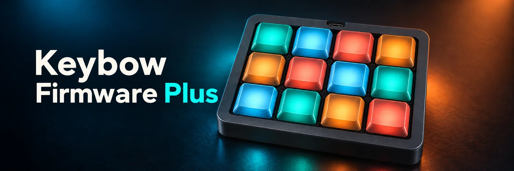
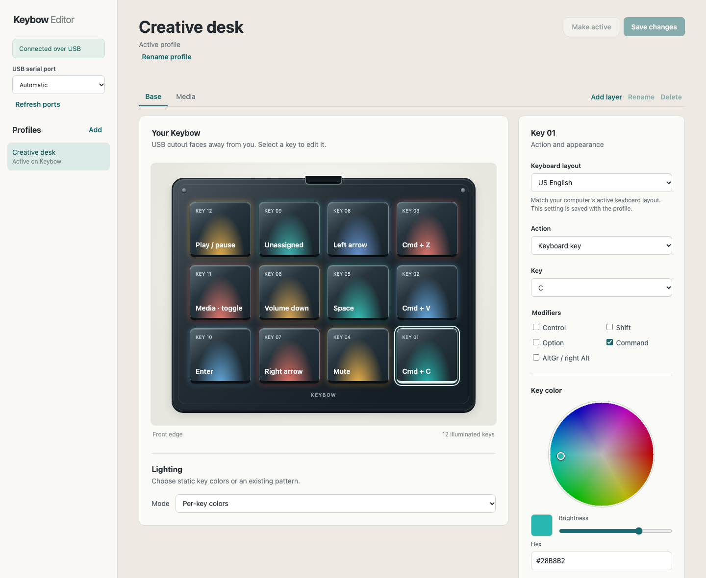
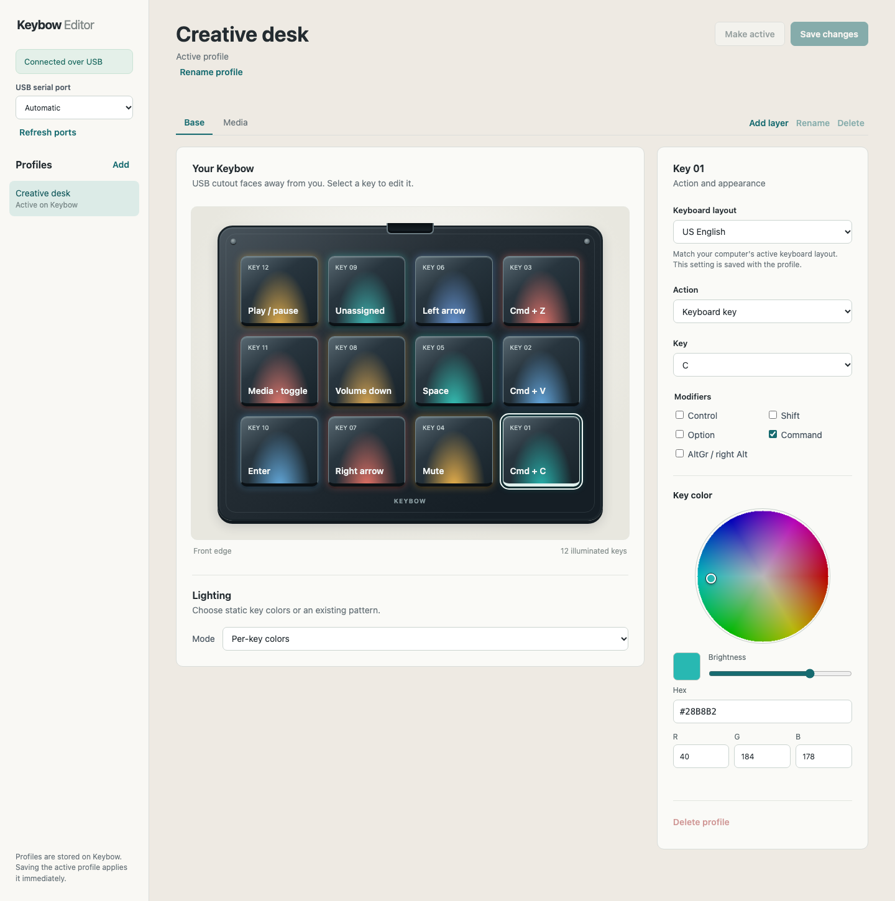
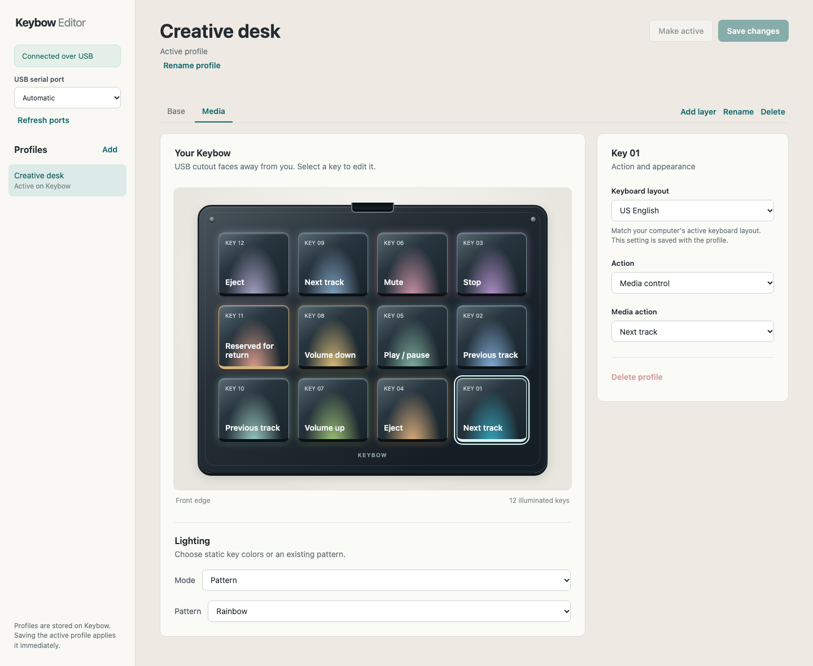

**Keybow Firmware Plus** is a fork of [Pimoroni's original Keybow firmware](https://github.com/pimoroni/keybow-firmware) for the **12-key Keybow**. It adds a desktop editor for keys, layers, profiles, and lighting, plus USB firmware updates after a one-time SD card upgrade. These additions have not been verified on Keybow MINI.

## Install

1. Download the SD card ZIP from the [`firmware-v0.0.1` release](https://github.com/ThoughtfulDev/keybow-firmware-plus/releases/tag/firmware-v0.0.1). Back up your card and follow the [one-time firmware installation guide](docs/firmware-update.md).
2. Download the app for your computer from the [`v0.0.1` editor release](https://github.com/ThoughtfulDev/keybow-firmware-plus/releases/tag/v0.0.1):

   | Computer | Download | Install |
   | --- | --- | --- |
   | Mac, Apple Silicon | `keybow-editor-macos-arm64.dmg` | Open the DMG and drag the app to Applications. Then run the command below. |
   | Mac, Intel | `keybow-editor-macos-x86_64.dmg` | Open the DMG and drag the app to Applications. Then run the command below. |
   | Windows 10/11 x64 | `keybow-editor-windows-x64.zip` | Extract the ZIP and run `KeybowEditor.exe` from its folder. |
   | Ubuntu 22.04/24.04 x64 | `keybow-editor-ubuntu-x64.deb` | Install with `sudo apt install ./keybow-editor-ubuntu-x64.deb`. |

   On macOS, remove the unsigned app's quarantine attribute after copying it to Applications and before opening it:

   ```sh
   xattr -dr com.apple.quarantine "/Applications/Keybow Editor.app"
   ```

3. Connect Keybow with a USB **data** cable and open the editor. Profiles are saved on Keybow, so they appear when you connect it to another computer with the editor installed.

See [installation details](docs/installation.md) for platform requirements and connection help, or [editor usage](docs/usage.md) to set up keys, layers, and colors. Later runtime firmware releases can be installed from the editor's **Firmware** section; editor app updates are separate downloads.

## For developers

[Development setup](docs/development.md) · [Build packages](docs/building.md) · [Coding guidelines](docs/coding-guidelines.md)

<details>
<summary>Editor screenshots</summary>

### Profile and device view



### Per-key color controls



### Media layer



Screenshots use a simulated demo profile; no connected Keybow profile was changed.

</details>

[License](LICENSE) · [Third-party notices](THIRD_PARTY_NOTICES.md) · [Original Keybow guides](https://learn.pimoroni.com/product/keybow)
